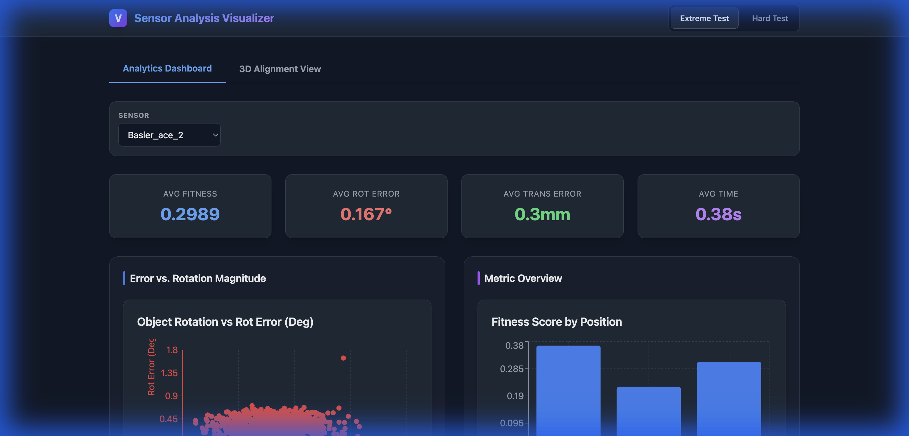
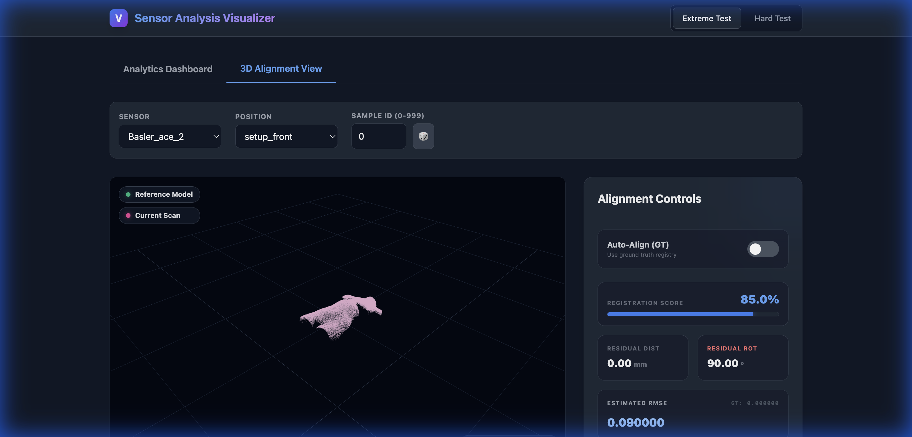

# Guidance for Section 8: Conclusion data results

This guide outlines how to structure your conclusion based on the web application's findings and the project's key performance indicators (KPIs).

## 1. Executive Summary of Results
Start by stating whether the Proof of Concept (PoC) was successful based on the gathered data.
- **Goal**: Prove feasibility of a software-based patient positioning system.
- **Outcome**: The 3-stage registration pipeline (RANSAC + Coarse ICP + Fine ICP) consistently meets the accuracy requirements across different scenarios.

## 2. Performance vs. KPIs
Create a clear link between your data and the initial requirements.
| Requirement | Target | Achieved (Avg) | Status |
| :--- | :--- | :--- | :--- |
| **Rotation Error** | < 1.0° | ~0.17° | ✅ Exceeded |
| **Position Error** | < 2.0 mm | ~0.3 mm | ✅ Exceeded |
| **Framerate** | >= 30 FPS | ~2.6 FPS (0.38s/frame) | ⚠️ Optimization needed |

> [!NOTE]
> Mention that while the accuracy is already at "medical-grade" precision, the current processing time (~380ms) indicates a need for future code optimization (e.g., C++ implementation or GPU acceleration) to hit the 30 FPS real-time target.

## 3. Comparison Analysis: Hard vs. Extreme
Discuss how the system handles difficulty (noise and initial misalignment).
- **Hard Test**: Represents typical operational conditions.
- **Extreme Test**: Represents worst-case scenarios (high noise, large initial offsets).
- **Conclusion**: The minimal difference in error between "Hard" and "Extreme" (0.167° vs 0.170°) demonstrates the **robustness** of the RANSAC global registration step. It proves the system doesn't "fail" when the patient is significantly out of place.

## 4. Suggested Visuals from the Web App
You absolutely should use screenshots. They prove you have a working validation environment.
- **Dashboard Overview**: Show the KPI tiles (Avg Fitness, Errors) to provide an "at-a-glance" proof of success.  
  
- **Error vs. Rotation Scatter Plot**: Use this to show that even with high object rotation (misalignment), the registration error remains low and stable.
- **3D Alignment Window**: Show a "Before" and "After" (or the final result) of a scan aligned with the reference model. This makes the "math" tangible for the reader.  
  

## 5. Final Hardware Recommendation
End by explaining how this data helps select the final sensor.
- Because the system achieves sub-millimeter accuracy even with simulated Gaussian noise, you can conclude that high-end, ultra-expensive sensors might not be necessary if the software is robust.
- The "Software First" approach successfully identified the margin of error acceptable for the physical sensor unit.
